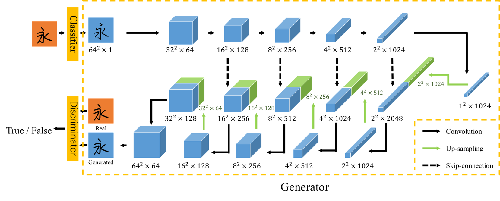
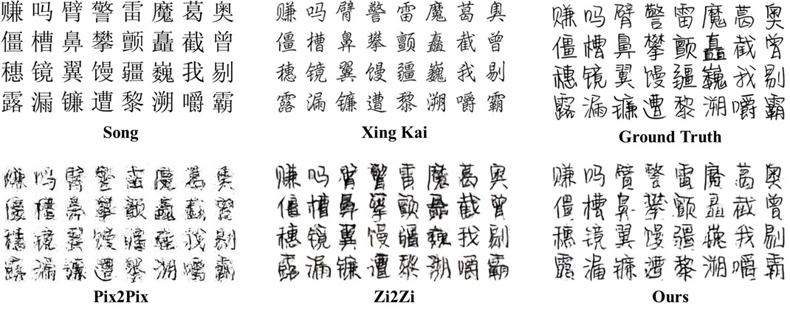
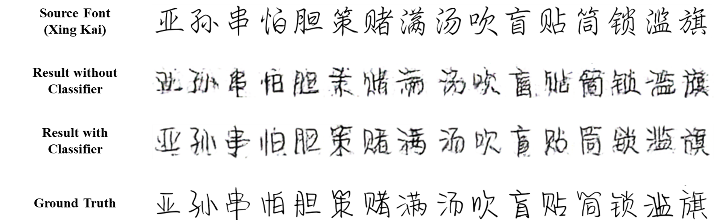
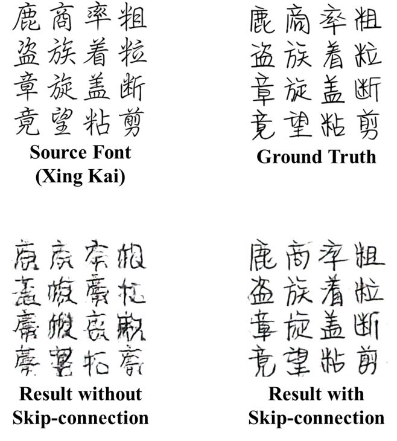
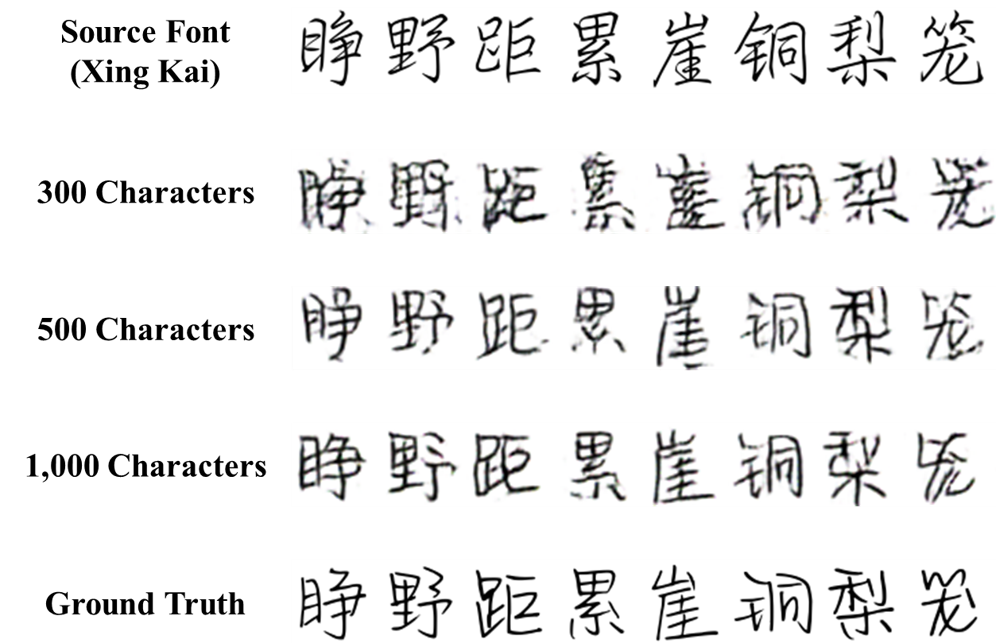
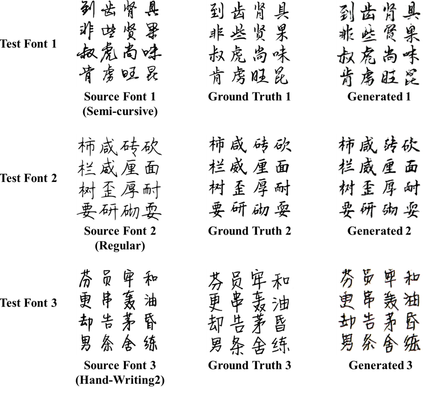

# Learning and Generation of Personal Handwriting Style Chinese Font

## Introduction
Personal handwriting style fonts generation is a diverting but time-consuming task due to the large size of Chinese character set. In addition, unlike standard printed style fonts, hand-writing style fonts are of more complicated stroke and glyph feature. In this paper, an improved network architecture is proposed for learning and generation of personal hand-writing style fonts based on small character set. The network is composed of three sub-networks: 1) a classification network for identifying the general style of the target fonts; 2) a generating network for transferring the identified fonts to the target fonts; 3) a discriminating network for differentiating the generated image from real ones. The experiments revealed the effectiveness of the model for generating personal hand-writing style font with relatively small data size, reduction by a scale of 10 comparing to previous reported works.

[Learning and Generation of Personal Handwriting Style Chinese Font](https://www.researchgate.net/publication/331564603_Learning_and_Generation_of_Personal_Handwriting_Style_Chinese_Font)

Yutian Lei, Liguang Zhou, Tianjiao Pan, Huihuan Qiann, Zhenglong Sun

The IEEE International Conference on Robotics and Biomimetics, 2018
 
 **Note**: The code and dataset will be released in the future`.

## Network Structure
### Original Model

the model consists of three sub-networks, classification network (the classifier), generating network (the generator), and discriminating network (the discriminator): the classifier is used to first identify the most similar font in our pre-collected font sets, the generator implements the learning and transferring from the identified font to our target font using the provided training data, and the discriminator tries to differentiate the generated images from the real ones. The latter two networks are optimized jointly. Details of the three sub-nets are discussed below.

The network structure is based off [pix2pix](https://arxiv.org/abs/1611.07004) and [zi2zi](https://github.com/kaonashi-tyc/zi2zi) with the addition of pre-trained feature classification network. 

## Experiments
### Experiments with Different Baseline Models

We train the aforementioned baseline models as well as ours using 500, approximate 15% characters from the source font and target font, and the rest of characters is used for testing. The training set and testing set are randomly selected and same for all the models. Some samples of the generated results by our models and baseline models are shown above. Specifically, with such a small data size, pix2pix does not achieve a good result: the results generated by pix2pix can only learn the general style of the target font, but for the detail of strokes and layout, most information is lost during transferring. The results generated by zi2zi show a much better result that its generated images are already close to the ground truth. However, noises are still obverse in the strokes of the generated characters, it is believed that the reason is that it cannot capture the complex personal writing style fully with such a small data size. Another evident is that in some complicated characters, the zi2zi model still fails to generate clear and recognizable strokes, for example the characters “矗”and “巍”. In comparison, our model significantly outperforms the two baseline models, especially for those complicated characters and cursive fonts. Some signs of noises are still noticeable but can be easily removed by basic filters. Therefore, the results show that the proposed model can capture and learn the personal hand-writing style through a relatively small size of training data.

### Effect of Classification Network

The classification network is proposed in our model to solve the dilemma that it is difficult generate a new handwriting font using only one pre-determined standard font like Song. Here specifically, only 300 characters are randomly selected as the training set to test the effectiveness of the classification network in a relatively small data size.

As shown above, the experiments are taken and compared between the case without classifier using a randomly selected source font (Song in this case) and the case with classifier using the fonts identified by the classification network as the source font. It is obvious that the classification network improves the performance of learning and generation for the reason that it can provide priori knowledge to subsequent networks, and thus help to save their efforts in learning.

### Effect of Skip-connection Structure

The result with skip-connection structure outperform significantly than without. It is an evidence that the skip-connection structure is able to recover the details of content and layout information that preserve in the previous layers since the style transfer in Chinese fonts is more sensitive to the stroke or layout distortion compared with other type of image to image translation tasks.

### Experiments with Different Training Set Sizes

To reduce the workload of generating or designing a new font, it is one of the main objectives for the proposed model to reduce the training data size. In order to investigate how the size of the training data set may affect the style learning and generation performance, three experiments using 300, 500, and 1,000 characters as the training data are taken. The testing character set is randomly selected and kept the same for all the cases. As shown above, the experiment with 300 characters learns the global style successfully but fails in some local details. The experiments with 500 and 1,000 characters doesn’t vary a lot, expect that the larger size of training set will generate more coherent structure.

### Experiments with Different Fonts

To further demonstrate validity of the proposed model, the experiments with 43 other style fonts are also taken. Three of these fonts are shown above as the ground truth 1-3. For each font, 500 characters are randomly selected from the list to be used as the training set and the rest characters are used for testing. According to the training characters, the classification network classified the three test fonts as Semi-cursive, Regular and Hand-Writing Font 2 in our source font set. 

The experiment shows satisfactory result for the test font 2, which has highly regular pattern, while the results for the test font 1 and 3 are of a few minor flaws, since for font 1 the joined-up writing style is more difficult to learn using a small data size, and for the font 3, it’s of more personal style and thus less regular pattern.

## Acknowledgements
Code derived and rehashed from:

* [pix2pix-tensorflow](https://github.com/yenchenlin/pix2pix-tensorflow)
* [zi2zi](https://github.com/kaonashi-tyc/zi2zi)

## License
Apache 2.0

